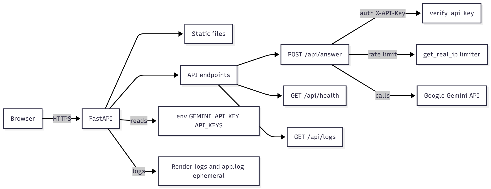

# README

## Architecture Diagram


## Threat List
- **Secrets in source** — `app.log` and `static/script.js` etc, may contain keys. these need to be looked after.
- **Sensitive data in logs** — Full LLM responses and queries are logged to `app.log`
- **Prompt injection / unsafe LLM outputs** — Inputs and outputs can leak or produce disallowed content.
- **Weak API authentication** — `X-API-Key` needs to be strong , changing and short-lived or per-user auth.
- **Rate-limit bypass / abuse** — IP-based 5/min can be bypassed
- **Overly permissive CORS** — Restrict `allow_origins` to exact origins
- **Ephemeral filesystem reliance** — `app.log` is ephemeral on instances; use external persistent logs/storage and avoid storing state locally.
- **Information leakage via errors** — Stack traces or un-sanitized exceptions may leak internals.
- **DoS / cost exhaustion** — Unbounded and unlimited LLM calls can drive costs

## Runbook

Quick operational guide to run and deploy the FastAPI app(`answer.py`).

### Quick start (local)
1. Prepare and activate venv:

```cmd
cd /d d:\SOAISEC\code
python -m venv .venv
.venv\Scripts\activate
```

2. Install deps:

```cmd
pip install -r requirements.txt
```

3. Set required env vars :
- `GEMINI_API_KEY=your_gemini_api_key`
- `API_KEYS=key1,key2` 

You can create a `.env` for local dev .

4. Run locally:

```cmd
set GEMINI_API_KEY=...
set API_KEYS=dev-key-12345
python answer.py
```

Or using uvicorn:

```cmd
uvicorn answer:app --host 0.0.0.0 --port 8000
```

5. Test endpoints (replace API_KEY):

```cmd
curl -X POST http://localhost:8000/api/answer -H "Content-Type: application/json" -H "X-API-Key: dev-key-12345" -d "{\"user_query\":\"hello\"}"
curl http://localhost:8000/api/health
curl -H "X-API-Key: dev-key-12345" http://localhost:8000/api/logs
```

### Deploy to Render 
- In Render dashboard, create a new Web Service and link the GitHub repo.
- Choose runtime: Python and set:
	- Build Command: `pip install -r requirements.txt`
	- Start Command: `uvicorn answer:app --host 0.0.0.0 --port $PORT`
- Add environment variables in Render dashboard:
	- `GEMINI_API_KEY` 
	- `API_KEYS` 

### Docker
- The `Dockerfile` provided can be used to set up and run this app as a Docker Container
- Build using :
```cmd
docker build -t secure-qa .
```
- Run using :
```cmd
docker run --env-file .env -p 8000:8000 secure-qa
```
(pre-made .env file needed)

### Tests
- Run pre-written tests from `tests/test_gaurdrails.py`
```cmd
pytest -v test_guardrails.py
```


